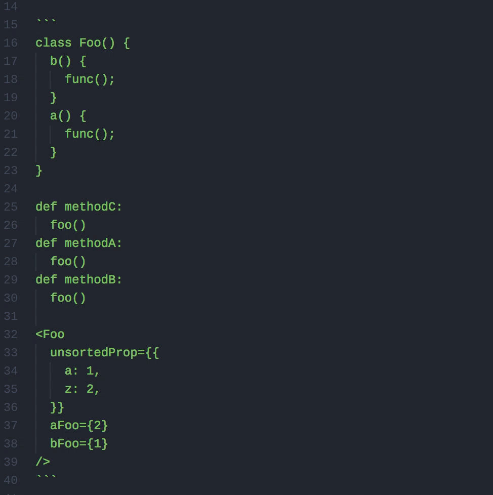

# Indent Sort

- Sorts while respecting indentation. Useful for when you have method in a class for example and you want to sort the methods, not the lines themselves.
- Uses the indentation from the line of the caret and sorts in respect to that.



```
class Foo() {
  b() {
    func();
  }
  a() {
    func();
  }
}

<Foo
  unsortedProp={{
    a: 1,
    z: 2,
  }}
  aFoo={2}
  bFoo={1}
/>
```

Will turn into:

```
class Foo() {
  a() {
    func();
  }
  b() {
    func();
  }
}

<Foo
  aFoo={2}
  bFoo={1}
  unsortedProp={{
    a: 1,
    z: 2,
  }}
/>
```

## keymap.json

This is the default keymap.json. Feel free to update it.

```
'atom-workspace':
  'cmd-shift-6': 'indent-sort:sort'
```
